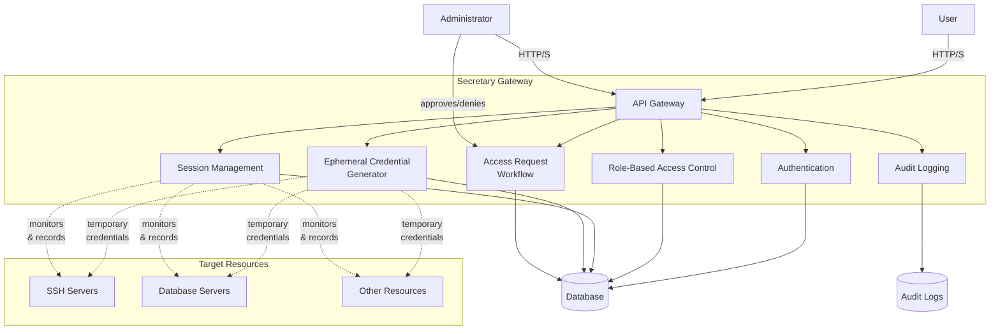
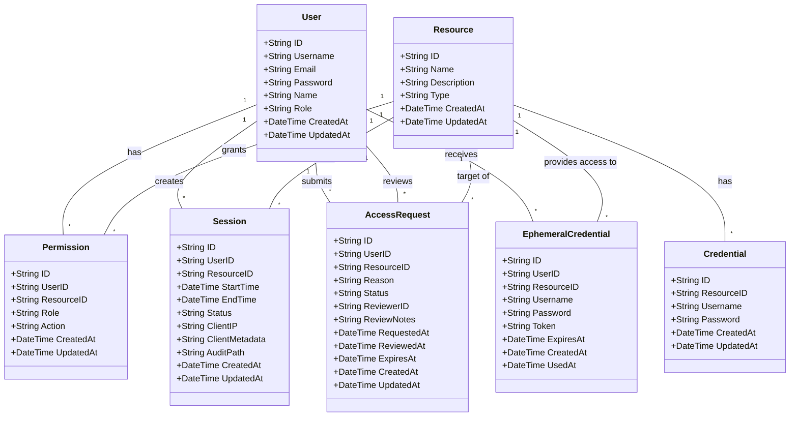

# Secretary Project Architecture

## System Architecture Diagram

This diagram illustrates the high-level architecture of the Secretary system, including the API gateway, session management, ephemeral credential generation, access request workflow, and connections to target resources.

## Domain Model Class Diagram

This diagram shows the main domain models and their relationships in the Secretary system.

